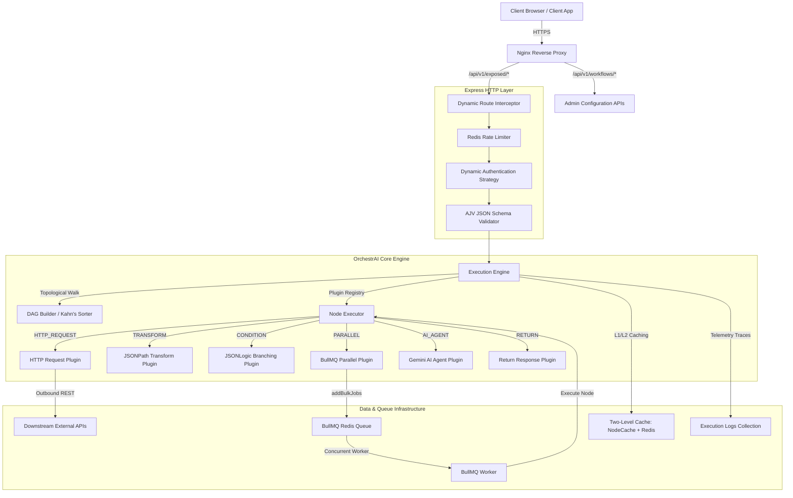
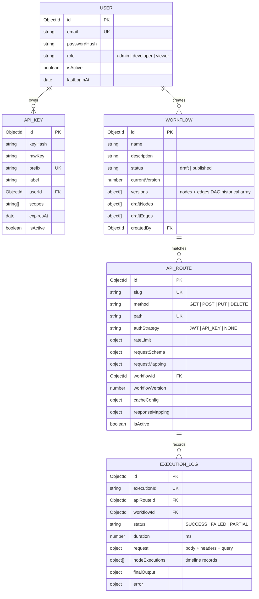

# 🌀 OrchestrAI — Low-Code API Orchestration Platform

OrchestrAI is a configuration-driven, low-code API orchestration engine that empowers developers to build, secure, cache, and deploy production-grade REST APIs visually. By combining a graph-based drag-and-drop canvas with an intelligent Gemini-powered AI Architect, the platform eliminates backend boilerplate code and lets you go from design to live endpoints in seconds.

> [!IMPORTANT]
> **Evaluator Test Account Credentials:**
> *   **Email**: `sumukeshmopuram1@gmail.com`
> *   **Password**: `12345678`

---

## 🚀 Key Features

*   **Visual DAG Canvas**: Build complex, multi-stage APIs by linking Schema Validators, HTTP requests, Conditions, Parallel Groups, Cache blocks, and Response Mappers.
*   **OrchestrAI Architect**: Describe your API flow in plain English (e.g. *Validate email, check cache, fetch from API on cache miss, and return*). The Gemini-powered AI automatically designs, configures, and connects the entire DAG.
*   **Built-in API Tester**: A full-featured Postman alternative directly in the console. Pick exposed routes, select API Keys, configure headers, edit JSON body, inspect responses, and view request history.
*   **Developer API Keys**: Generate secure external integration credentials, featuring an on-demand full key reveal (`Eye` toggle) and one-click clipboard copying.
*   **L1/L2 Caching**: High-performance caching layers using Redis and In-Memory NodeCache to serve repeat requests in milliseconds.
*   **API Gateway**: Expose your visual workflows to custom HTTP endpoints (e.g. `POST /api/v1/exposed/kyc`) with built-in rate-limiting and authorization rules.
*   **Execution Logs**: Real-time status logs and latency metrics of every single API execution, with step-by-step telemetry breakdowns and Gemini-assisted root-cause debugging.
*   **Node Configuration Guide**: An interactive, built-in reference documentation describing what each node does, how it works, and how to write configurations with examples.

---

## 🏗️ System Architecture

The platform is designed with **Clean Architecture** patterns, decoupling core domain models, application use cases, and infrastructural adapters.

### 1.1 — Overall System Design


### 1.2 — Database Entity Relationship (ER) Diagram


---

## 🛠️ Setup & Deployment Guide

### 4.1 — Quick Local Setup (Docker Compose)
The easiest way to spin up the entire stack (Nginx, React Frontend, Express Backend, MongoDB, and Redis) is using Docker Compose:

1. Clone the repository.
2. Open `docker-compose.yml` and set the `GEMINI_API_KEY` environment variable.
3. Build and launch all services:
   ```bash
   docker compose up --build
   ```
4. Access the portal:
   *   **Frontend Console**: `http://localhost` (Port 80)
   *   **Backend API**: `http://localhost:3000`
   *   **OpenAPI Swagger Docs**: `http://localhost:3000/docs`
   *   **Prometheus Metrics**: `http://localhost:3000/metrics`

---

### 4.2 — Manual Local Setup (Development Mode)
If you wish to run the frontend and backend manually for development:

#### Prerequisite:
Ensure MongoDB is running locally on port `27017` and Redis is running on port `6379`.

#### Step 1: Start the Backend
```bash
cd backend
# Create config environment file
cp .env.example .env
# Set your GEMINI_API_KEY in .env

# Install packages
npm install
# Seed the database
npm run seed
# Start development watcher
npm run dev
```

#### Step 2: Start the Frontend
```bash
cd ../frontend
# Install packages
npm install
# Start dev server
npm run dev
```
Open `http://localhost:5173` in your browser. Log in with the seeded developer credentials:
*   **Email**: `dev@orchestai.com`
*   **Password**: `developer1234`

---

## ⚡ Testing Dynamic Route Example

This guide demonstrates the pre-seeded dynamic API route: `POST /api/v1/exposed/client-enrichment`.

### 5.1 — Database Seeding
To seed the database with sample workflow configurations:
```bash
cd backend
npm run seed
```

### 5.2 — Sample HTTP Request (Triggering execution)
Submit a `POST` request to the exposed endpoint:
*   **URL**: `http://localhost:3000/api/v1/exposed/client-enrichment`
*   **Headers**:
    *   `Content-Type: application/json`
    *   `X-API-Key: ak_test_key_value_1234567890`
*   **Request Body**:
    ```json
    {
      "pan": "ABCDE1234F",
      "userId": 5
    }
    ```

### 5.3 — Standardized Platform Response
```json
{
  "success": true,
  "data": {
    "taxIdentifier": "ABCDE1234F",
    "profile": {
      "firstName": "Youssef",
      "lastName": "Brahimi",
      "contactEmail": "youssef.brahimi@x.dummyjson.com"
    },
    "employment": {
      "companyName": "Nokia",
      "role": "Database Administrator"
    },
    "meta": {
      "status": "Verified and transformed"
    }
  },
  "meta": {
    "correlationId": "50c8227b-232f-4c81-807d-3046f499b921",
    "executionId": "8bfa2e2a-1fa9-43c3-9828-54bca11c6d12",
    "duration": 482,
    "cached": false
  }
}
```
